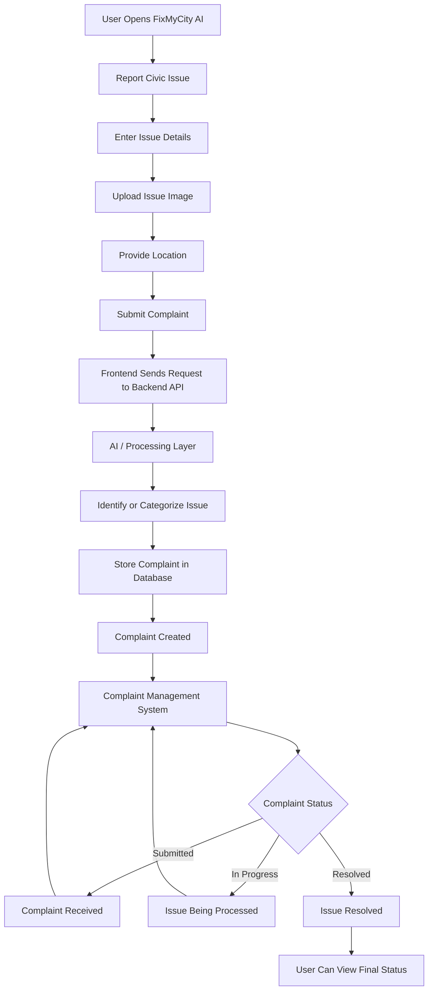
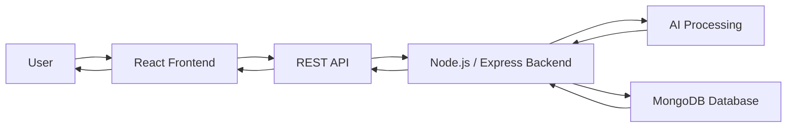

# FixMyCity AI

FixMyCity AI is an AI-powered civic issue reporting platform designed to make reporting local infrastructure and public-service problems easier, faster, and more organized.

The platform allows users to report issues such as potholes, garbage, damaged roads, broken streetlights, water leakage, drainage problems, and other civic concerns. The system provides a simple digital workflow through which complaints can be submitted, managed, tracked, and resolved.

---

## Overview

Traditional civic complaint systems can be difficult to navigate and often require users to manually explain, categorize, and follow up on issues.

FixMyCity AI provides a centralized platform where users can report civic problems digitally. The application is designed to simplify complaint submission and provide a structured workflow for handling reported issues.

The project combines a modern React frontend with backend APIs and database-driven complaint management.

---

## Key Features

- User-friendly civic issue reporting
- Report issues with relevant details
- Image-based complaint submission
- Location information for reported problems
- AI-assisted issue processing
- Automatic or assisted issue categorization
- Complaint status tracking
- Centralized complaint management
- Responsive user interface
- REST API based frontend-backend communication
- Database-driven complaint records
- Scalable architecture for future civic-service integrations

---

## Civic Issues

FixMyCity AI can be used for reporting issues such as:

- Potholes
- Road damage
- Garbage accumulation
- Broken streetlights
- Water leakage
- Drainage problems
- Public infrastructure damage
- Other civic issues

---

## Technology Stack

### Frontend

- React.js
- Vite
- JavaScript
- HTML5
- CSS3

### Backend

- Node.js
- Express.js
- REST APIs

### Database

- MongoDB

### Development and Deployment

- Git
- GitHub
- npm
- Render

---

## Project Architecture

```text
fixmycity-ai/
│
├── client/
│   ├── public/
│   ├── src/
│   │   ├── components/
│   │   ├── pages/
│   │   ├── assets/
│   │   └── App.jsx
│   │
│   ├── index.html
│   ├── package.json
│   ├── package-lock.json
│   └── vite.config.js
│
├── server/
│   ├── controllers/
│   ├── models/
│   ├── routes/
│   ├── middleware/
│   ├── server.js
│   └── package.json
│
└── README.md
```

The exact folder structure may vary as the project continues to develop.

---

# Application Workflow

The basic workflow of FixMyCity AI is:



---

## System Architecture Flow



---

## Complaint Processing Flow

```text
User
  |
  v
Open FixMyCity AI
  |
  v
Report an Issue
  |
  v
Enter Complaint Details
  |
  +----------------+
  |                |
  v                v
Upload Image    Add Location
  |                |
  +-------+--------+
          |
          v
    Submit Complaint
          |
          v
      Backend API
          |
          v
     AI Processing
          |
          v
   Issue Categorization
          |
          v
    Save to Database
          |
          v
    Complaint Created
          |
          v
  Complaint Management
          |
          v
 Submitted -> In Progress -> Resolved
          |
          v
    User Tracks Status
```

---

## How It Works

### 1. Report an Issue

The user opens FixMyCity AI and provides information about a civic problem.

### 2. Upload Evidence

The user can provide an image or other relevant information related to the reported issue.

### 3. Add Location

Location information helps identify where the civic issue exists.

### 4. Submit Complaint

The frontend sends the complaint information to the backend through the API.

### 5. Process the Issue

The backend validates and processes the submitted information. AI functionality can assist with understanding or categorizing the reported problem.

### 6. Store Complaint

The complaint and its associated information are stored in the database.

### 7. Track Progress

The complaint can move through different stages such as:

```text
Submitted
   |
   v
In Progress
   |
   v
Resolved
```

Users can track the progress of their submitted complaints.

---

# Local Installation

## 1. Clone the Repository

```bash
git clone https://github.com/Ravneet-project/fixmycity-ai.git
```

Move into the project:

```bash
cd fixmycity-ai
```

---

## 2. Install Frontend

```bash
cd client
npm install
```

Start the development server:

```bash
npm run dev
```

Vite will display the local development URL in the terminal.

---

## 3. Install Backend

Open another terminal:

```bash
cd fixmycity-ai
cd server
npm install
```

Start the backend:

```bash
npm start
```

If the backend uses a development script, use:

```bash
npm run dev
```

---

## Environment Variables

Create the required `.env` file for backend configuration.

Example:

```env
PORT=5000

MONGODB_URI=your_mongodb_connection_string

AI_API_KEY=your_api_key

CLIENT_URL=http://localhost:5173
```

Do not commit API keys, database passwords, tokens, or other secrets to GitHub.

Add environment files to `.gitignore`:

```gitignore
.env
.env.local
node_modules/
dist/
```

---

# Build Frontend

To create a production build:

```bash
cd client
npm run build
```

Vite generates the production files inside:

```text
client/dist/
```

---

# Render Deployment

For the frontend Web Service, the project can be configured with:

### Root Directory

```text
client
```

### Build Command

```bash
npm ci && npm run build
```

### Start Command

```bash
npm run preview -- --host 0.0.0.0 --port $PORT
```

If Vite restricts the Render hostname, configure the Render domain under `preview.allowedHosts` in `vite.config.js`.

---

# API Architecture

The application follows a frontend/backend architecture:

```text
React Application
       |
       | HTTP Request
       v
   Express API
       |
       +-----------> AI Processing
       |
       +-----------> MongoDB
       |
       v
   API Response
       |
       v
React Application
```

This separation makes it easier to maintain and extend the application.

---

# Future Improvements

The project can be expanded with features such as:

- User authentication
- Admin dashboard
- Complaint assignment
- Department-based routing
- Real-time complaint updates
- Email notifications
- Complaint history
- Interactive maps
- GPS-based issue reporting
- AI image classification
- Duplicate complaint detection
- Priority detection
- Analytics dashboard
- Authority/department accounts
- Mobile application
- Citizen feedback and resolution verification

---

# Project Objective

The objective of FixMyCity AI is to demonstrate how modern web technologies and artificial intelligence can be combined to create a structured platform for reporting and managing civic issues.

The system aims to make communication between citizens and civic-service workflows simpler, more transparent, and easier to manage.

---

## Repository

GitHub Repository:

```text
https://github.com/Ravneet-project/fixmycity-ai
```

---

## Author

**Ravneet Kaur**

Full Stack Developer  
MERN Stack Developer

GitHub: Ravneet-project

---

## License

This project is developed for educational and portfolio purposes.
